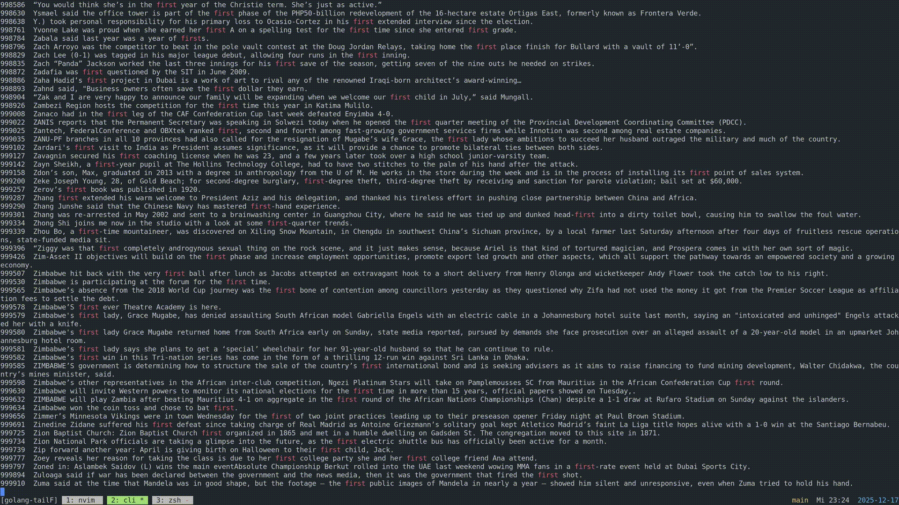

## Interactive replacement for -> tail -f -n 600 file.txt | grep "search"

### with the difference without options it is only highlighting the search

### No dependencies! only the go standard library

### The goal was to fast and interactive watch and search(highlight) a file without everytime when I want to change the search that I need to cancel and start the last "tail | grep" again.

```bash
-tail -n 1000 file.txt | grep "search"
```



## Argument options:

### -n specifies how many lines to watch

### -g only print line that match search

### main.go -n 50 file.txt

### main.go -g file.txt

### Summary

```bash
| Tool                      | Read Size | Time     | Throughput  |
| ------------------------- | --------- | -------- | ----------- |
| tailF 1000 lines          | 106 KB    | ~0.29 ms | ~368 MB/s   |
| tailF -g 1000 lines       | 106 KB    | ~0.28 ms | ~381 MB/s   |
| tailF highlight 32000     | 3.4 MB    | ~6.6 ms  | ~514 MB/s  |
| tailF grep 32000          | 3.4 MB    | ~7.4 ms  | ~460 MB/s   |
| GNU `tail -n 32000| grep` | 3.4 MB    | ~5 ms    | ~680 MB/s   |
| GNU `tail -n 1000 | grep` | 106 KB    | ~1.93 ms | ~55 MB/s    |
```

## Below I show actual results when running the program

### of course this takes longer as it prints to your terminal and that is highly dependend on the emulator

### I ran it on -> terminal: alacritty in tmux

## All benchmarks were run on:

- Linux (amd64)
- Intel® Core™ i7-8700K @ 3.70GHz
- Warm filesystem cache

# Go tools

```bash
❯ go test -bench=. -benchmem
goos: linux
goarch: amd64
pkg: github.com/alex/tailF
cpu: Intel(R) Core(TM) i7-8700K CPU @ 3.70GHz
BenchmarkMaxLines_Highlight-12                       205           6641593 ns/op                 3.418 inputSize/mb              6.642 ms/op           514.6 throughput/MBps    15174319 B/op         51 allocs/op
BenchmarkMaxLines_GrepFlag-12                        162           7429095 ns/op                 3.418 inputSize/mb              7.429 ms/op           460.1 throughput/MBps    23923337 B/op         76 allocs/op
BenchmarkQuaterOfLines_Highlight-12                  691           1715462 ns/op                 0.8545 inputSize/mb             1.715 ms/op           498.1 throughput/MBps     3803759 B/op         51 allocs/op
BenchmarkQuaterOfLines_GrepFlag-12                   529           2337449 ns/op                 0.8545 inputSize/mb             2.337 ms/op           365.6 throughput/MBps     6261330 B/op         75 allocs/op
BenchmarkDefaultLines_Highlight-12                  3849            290118 ns/op                 0.1068 inputSize/mb             0.2901 ms/op          368.2 throughput/MBps      500633 B/op         22 allocs/op
BenchmarkDefaultLines_GrepFlag-12                   4189            279806 ns/op                 0.1068 inputSize/mb             0.2798 ms/op          381.7 throughput/MBps      795552 B/op         28 allocs/op
BenchmarkMaxLinesNoSearch_Highlight-12               468           2513783 ns/op                 3.418 inputSize/mb              2.514 ms/op          1360 throughput/MBps       7178768 B/op         39 allocs/op
BenchmarkMaxLinesNoSearch_GrepFlag-12                463           2507968 ns/op                 3.418 inputSize/mb              2.508 ms/op          1363 throughput/MBps       7178768 B/op         39 allocs/op
PASS


```

### For the tests you need to run createTestFile.sh first -> this will create ./assets/testFiles/big.txt

# GNU tools

```bash
#actually running tailF and searching on max size
# terminal: alacritty in tmux
❯ sudo perf stat ./tailF -n 32000 ./assets/testFiles/big.txt

Performance counter stats for './tailF -n 32000 ./assets/testFiles/big.txt':

            489,77 msec task-clock                       #    0,034 CPUs utilized
             2.021      context-switches                 #    4,126 K/sec
               135      cpu-migrations                   #  275,640 /sec
            15.801      page-faults                      #   32,262 K/sec
     2.075.514.153      cycles                           #    4,238 GHz
     2.249.781.883      instructions                     #    1,08  insn per cycle
       619.884.541      branches                         #    1,266 G/sec
         4.660.870      branch-misses                    #    0,75% of all branches

      14,202307954 seconds time elapsed

       0,115844000 seconds user
       0,377021000 seconds sys


# actually running tailF and searching on default lines(600)
# terminal: alacritty in tmux
❯ sudo perf stat ./tailF ./assets/testFiles/big.txt

 Performance counter stats for './tailF ./assets/testFiles/big.txt':

             21,94 msec task-clock                       #    0,002 CPUs utilized
               710      context-switches                 #   32,366 K/sec
                44      cpu-migrations                   #    2,006 K/sec
             1.344      page-faults                      #   61,268 K/sec
        84.953.228      cycles                           #    3,873 GHz
        83.724.243      instructions                     #    0,99  insn per cycle
        22.295.267      branches                         #    1,016 G/sec
           242.355      branch-misses                    #    1,09% of all branches

      11,119000820 seconds time elapsed

       0,001296000 seconds user
       0,022037000 seconds sys


# more extended stat version from summary above
❯ sudo perf stat -r 50 \
  sh -c 'tail -n 32000 ./assets/testFiles/big.txt | grep "th" > /dev/null'


 Performance counter stats for 'sh -c tail -n 32000 ./assets/testFiles/big.txt | grep "th" > /dev/null' (50 runs):

              5,21 msec task-clock                       #    1,367 CPUs utilized               ( +-  0,34% )
               159      context-switches                 #   30,544 K/sec                       ( +-  0,63% )
                 0      cpu-migrations                   #    0,000 /sec
               299      page-faults                      #   57,439 K/sec                       ( +-  0,32% )
        20.865.255      cycles                           #    4,008 GHz                         ( +-  0,33% )
        15.588.783      instructions                     #    0,75  insn per cycle              ( +-  0,11% )
         2.905.234      branches                         #  558,103 M/sec                       ( +-  0,10% )
            56.881      branch-misses                    #    1,96% of all branches             ( +-  3,00% )

         0,0038091 +- 0,0000162 seconds time elapsed  ( +-  0,43% )


# more extended stat version from summary above
❯ sudo perf stat -r 50 \
  sh -c 'tail -n 600 ./assets/testFiles/big.txt | grep "th" > /dev/null'


 Performance counter stats for 'sh -c tail -n 1000 ./assets/testFiles/big.txt | grep "th" > /dev/null' (50 runs):

              1,93 msec task-clock                       #    1,216 CPUs utilized               ( +-  0,35% )
                 5      context-switches                 #    2,586 K/sec                       ( +-  1,67% )
                 0      cpu-migrations                   #    0,000 /sec
               303      page-faults                      #  156,703 K/sec                       ( +-  0,09% )
         8.200.026      cycles                           #    4,241 GHz                         ( +-  0,35% )
         6.871.824      instructions                     #    0,84  insn per cycle              ( +-  0,05% )
         1.254.634      branches                         #  648,860 M/sec                       ( +-  0,04% )
            42.231      branch-misses                    #    3,37% of all branches             ( +-  1,23% )

        0,00159044 +- 0,00000734 seconds time elapsed  ( +-  0,46% )

```
